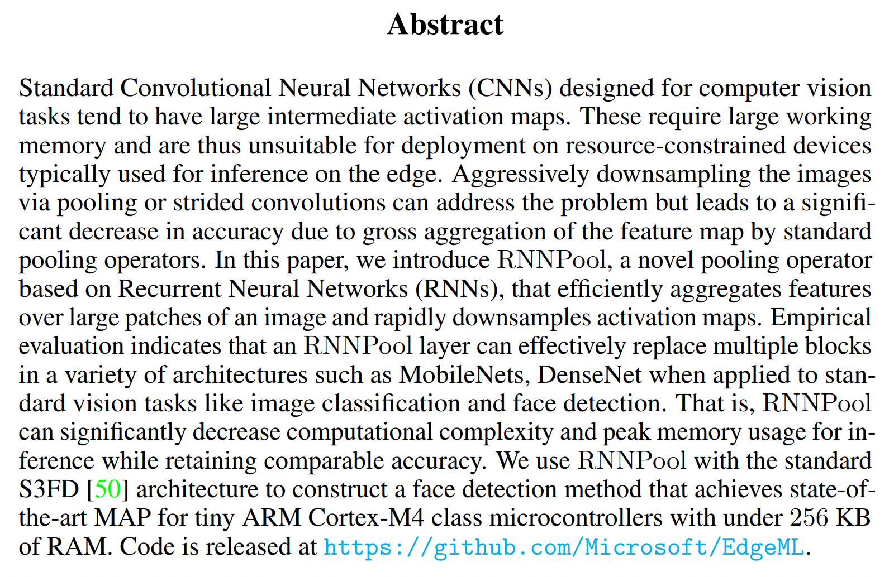
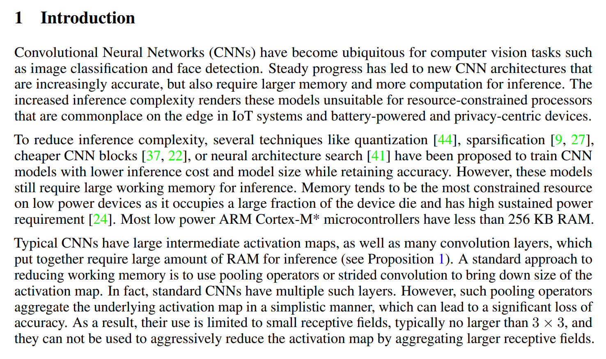
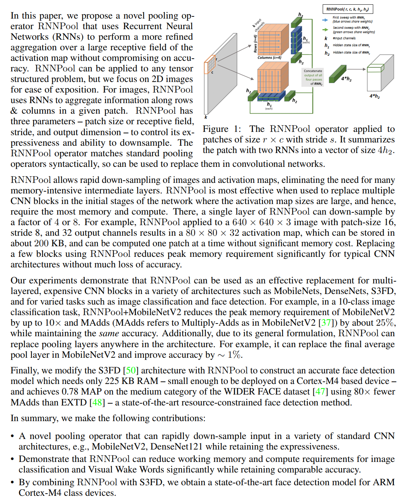

# Translation for Abstract and Introduction

## 1 Abstract

### 1.1 Original

### 1.2 Translation

摘要

为计算机视觉任务所设计的标准卷积神经网络（CNNs）往往具有规模较大的中间层激活图。这些激活图占用了大量的运行内存，因而不适合部署在用于边缘推理而资源受限的设备上。该问题能通过池化或跨步卷积操作对图像进行有效的下采样来解决，但由于对特征图所执行的标准池化操作仅仅是一种粗糙、简单的聚合，这种方法会使得模型准确率显著下降。本论文基于循环神经网络（RNNs）提出了一个独创的池化算子 ———— RNNPool，该操作能高效地对图像中的大块像素区域进行特征聚合，从而快速地对激活图进行下采样。经验评估表明，在面对诸如图像分类、人脸检测等标准视觉任务时，RNNPool 层能有效地替换许多网络模型中的多个网络层，比如 MobileNets、DenseNet。也就是说，RNNPool 可以显著地降低推理时的计算复杂度和峰值内存使用率，同时保留住与原模型相近的准确率。我们在标准 S3FD 架构上使用 RNNPool 构建了一个人脸检测方案，该方案以低于 256 KB 的内存占用取得了在微型 ARM Cortex-M4 微控制器上至今最高的 MAP。代码公布在 https://github.com/Microsoft/EdgeML。

## 2 Introduction

### 2.1 Original

### 2.2 Translation

1 引言

卷积神经网络（CNNs）在计算机视觉任务中普遍存在，比如图像分类和人脸检测。随着技术发展，新的卷积神经网络架构达到了越来越高的准确率，但同时也对推理时的内存容量与计算资源提出了更高的要求。越来越高的推理复杂度使得这些网络模型难以部署在资源受限的处理器上，而这些处理器在物联网系统的边缘以及电池供电和以隐私为中心的设备中很常见。

为了降低推理的复杂性，当下已经提出了量化 [44]、稀疏化 [9、27]、计算复杂度更低的的卷积神经网络块 [37、22] 或神经网络结构搜索 [41] 等几种技术来训练具有较低推理成本和模型大小的卷积神经网络模型，同时保持准确性。然而，这些模型仍然需要大量的工作内存来进行推理。内存往往是低功耗设备上最受限制的资源，因为它占据了设备芯片的很大一部分并且具有很高的持续功率要求 [24]。大多数低功耗 ARM Cortex-M* 微控制器的 RAM 小于 256 KB。

典型的卷积神经网络有很大的中间激活图和许多卷积层，以其组合而成的模型需要大量的 RAM 进行推理（见命题 1）。减少工作内存的标准方法是使用池化操作或跨步卷积来减小激活图的尺寸。事实上，标准卷积神经网络有多个这样的层。然而，此类池化算子以一种简单的方式聚合了底层的激活图，这可能显著降低准确率。因此，它们仅能在小的感受野中使用，通常不大于 3 × 3，并且它们不能通过聚合更大的感受野来显著地下采样激活图。

在本文中，我们提出了一种独创的池化算子 RNNPool，它使用循环神经网络（RNN）在激活图中较大的感受野上执行更精细的聚合，而不会降低准确性。RNNPool 可以应用于任何张量结构的场景，但为了便于说明，我们专注于 2D 图像。对于图像，RNNPool 使用循环神经网络来聚合给定像素区域中行和列的信息。RNNPool 具有三个参数 ———— 像素区域大小或感受野、步长和输出维度 ———— 来控制其表征能力和下采样能力。 RNNPool 算子与标准池化算子相似，因此可用于在卷积网络中替换它们。

> 图 1：RNNPool 算子应用于大小为 r × c、步长为 s 的像素区域。它利用两个循环神经网络将像素区域聚合为一个大小为 $4h_2$ 的向量。

RNNPool 能对图像和激活图进行快速下采样，从而无需耗费大量内存以存储中间层。RNNPool 在网络初始阶段用于替换多个卷积神经网络块时最有效，因为在该阶段里激活图的尺寸很大，因此需要最多的内存和计算资源。在该阶段，单层 RNNPool 可将激活图下采样至原来的 1/4 或 1/8。例如，像素块大小为 16，步幅为 8，输出通道为 32 的 RNNPool 应用于 640 × 640 × 3 图像后可得到 80 × 80 × 32 激活图，该激活图仅占用 200 KB 内存，并且可以一次计算一个像素块，从而无需占用大量内存。使用 RNNPool 替换几个块可以显着降低经典卷积神经网络架构的峰值内存需求，而不会降低过多准确率。

我们的实验表明，RNNPool 可以在各种架构（如 MobileNets、DenseNets、S3FD）中用作多层的、计算复杂的 CNN 块的有效替代品，并用于图像分类和人脸检测等各种任务。例如，在 10 类图像分类任务中，RNNPool + MobileNetV2 模型将 MobileNetV2 模型的峰值内存需求降低到原来的 1/10，将 MAdds（MAdds 指的是 MobileNetV2 [37] 中的 Multiply-Adds）降低了约 25%，同时保持相同的精度。此外，由于其通用的运算操作，RNNPool 可以替换网络架构中任何位置的池化层。例如，它可以取代 MobileNetV2 中最后的平均池化层，并将准确率提高约 1%。

最后，我们用 RNNPool 修改 S3FD [50] 架构来构建一个精确的人脸检测模型，该模型只需要 225 KB RAM（小到足以部署在基于 Cortex-M4 的设备上），并且在 WIDER FACE 的中等类别数据集 [47] 上以 EXTD [48] 模型 1/80 的 MAdds 实现 0.78 MAP ———— 这是至今最先进的资源受限条件下的人脸检测方法。

总之，我们做出了以下贡献：

* 一种独创的池化算子，可以在各种标准 CNN 架构（例如 MobileNetV2、DenseNet121）中快速对输入进行下采样，同时保持表征能力。
* 证明 RNNPool 可以显著降低图像分类和视觉唤醒任务的工作内存和计算要求，同时保持相当的准确性。
* 通过将 RNNPool 与 S3FD 相结合，我们获得了用于 ARM Cortex-M4 类设备的最先进的人脸检测模型。